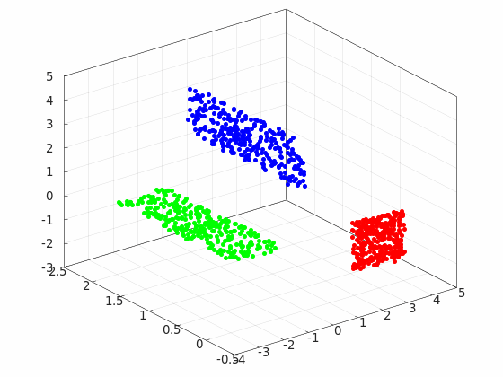

# growing_neural_gas

[](https://github.com/TakumaNakao/growing_neural_gas/actions/workflows/build.yml)

## What is this?
Demonstration of Growing-Neural-Gas.

## Dependencies
* CMake
* Eigen3
* Matplot++

## Docker
Launch Docker with the following command:
```
bash docker_bringup.sh
```

## Build
build
```
bash build.sh
```
clean build
```
bash clean_build.sh
```
## 例

